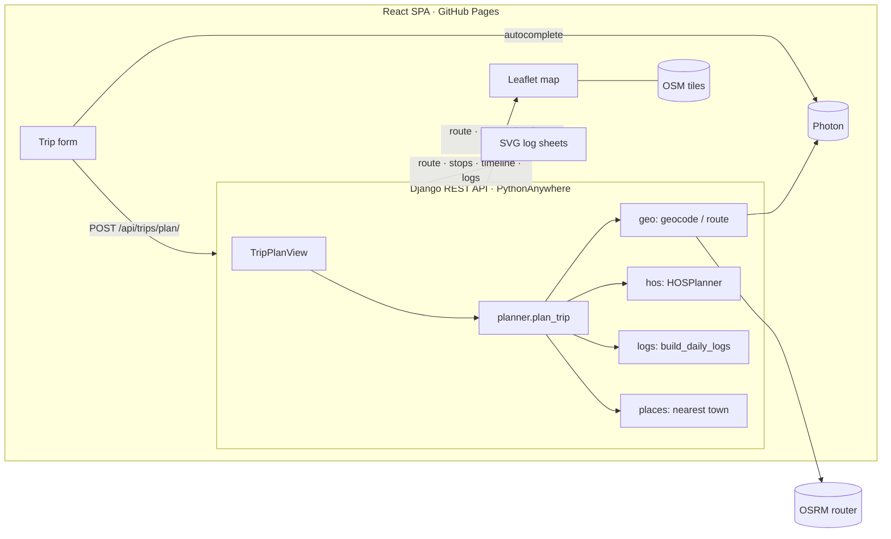

# Architecture

## Request lifecycle

1. **Input.** The form sends each location as either a pre-geocoded `{label, lat, lon}` (picked from autocomplete) or free text, along with the cycle hours used and the departure time.
2. **Geocode.** Free-text locations are resolved in parallel (Photon, falling back to Nominatim).
3. **Route.** A single OSRM request returns the geometry, both legs and turn-by-turn steps.
4. **Simulate.** `HOSPlanner` walks the legs minute by minute. It inserts breaks, rests, fuel stops and restarts whenever the next limit would be hit.
5. **Locate.** Each activity's trip mile is mapped to a coordinate on the polyline, then to the nearest town using a bundled GeoNames table (no network calls).
6. **Logs.** Activities are split at midnight into daily sheets with segments, totals, remarks and the recap.

## Backend layout

| Module | Responsibility |
| --- | --- |
| `trips/services/hos.py` | Pure HOS state machine: no I/O, fully unit-tested |
| `trips/services/logs.py` | Activities → per-day log sheets |
| `trips/services/geo.py` | HTTP clients (OSRM, Photon, Nominatim) and polyline maths |
| `trips/services/places.py` | Offline nearest-town lookup |
| `trips/services/planner.py` | Orchestration and response shaping |
| `trips/serializers.py`, `views.py` | Validation and HTTP boundary |

The API is stateless and has no database.

## Frontend layout

| Path | Responsibility |
| --- | --- |
| `src/api/client.ts` | API and autocomplete calls |
| `src/components/layout` | Sidebar, page header, tabs |
| `src/components/trip-form` | Trip bar, address autocomplete, log-sheet header details |
| `src/components/summary` | KPI strip |
| `src/components/map` | Leaflet route, stop markers, truck at the playhead |
| `src/components/hos` | HOS clocks, current status, upcoming stops |
| `src/components/timeline` | Whole-trip duty-status graph with a draggable playhead |
| `src/components/logs` | Daily log graph, events table, recap, and the SVG paper *Drivers Daily Log* |
| `src/components/itinerary` | Stops table and turn-by-turn directions |
| `src/lib/hos.ts` | Client-side HOS replay that drives the clocks at any moment of the trip |
| `src/types/trip.ts` | API contract types |
